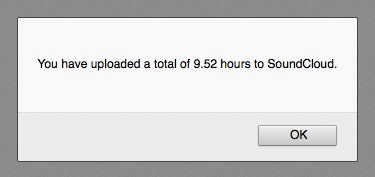

How much time on my hands?
==========================

I got a renewal email from [SoundCloud](http://soundcloud.com) and I wanted to know about the implications of downgrading my "Pro Unlimited plan," which allows *unlimited* uploads to a "Pro" plan, which allows only 4 hours *total lifetime* uploads.

Unfortunately the SoundCloud web app doesn't have a mechanism for "Pro Unlimited" users like me to get a count of the total lifetime uploads to date, which makes understanding the implications of downgrading difficult to grasp.

So I wrote a little JavaScript app to count this up for me.

How to Use
----------

On a Mac (which is all I've tested on):

1. Clone this repository.
2. Generate a new SoundCloud App Key from [here](http://soundcloud.com/you/apps).
3. Paste the Client ID from your new app into index.html, replacing INSERT_SOUNDCLOUD_APP_KEY_HERE.
4. Install [Anvil](http://anvilformac.com/).
5. Point Anvil at the repository you cloned, which should make [howmuchtime.dev](http://howmuchtime.dev) active on your Mac.
6. Visit [howmuchtime.dev](http://howmuchtime.dev) from a browser on your Mac.

The result should be something like this:

